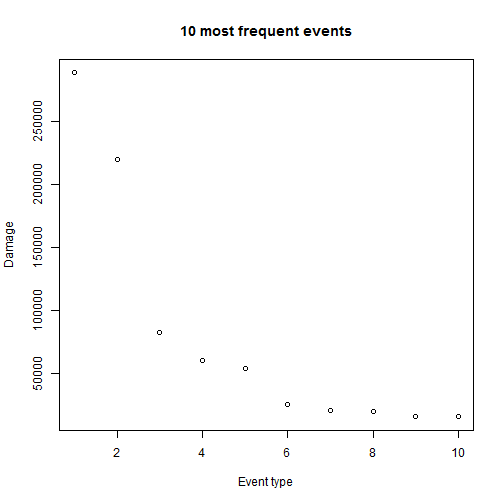
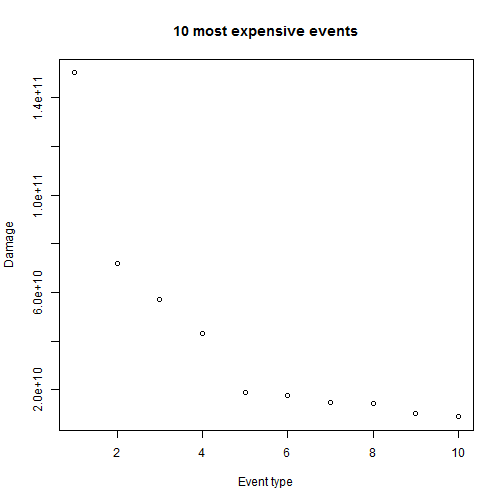
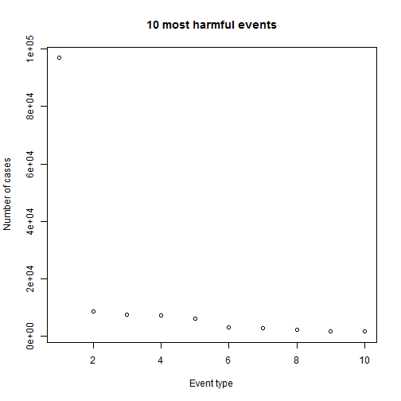

Reproducible Research Peer Assessment 2 - 
Impact of Severe Weather
==================================================================

Introduction
------------
Storms and other severe weather events can cause both public health and economic problems for communities and municipalities. Many severe events can result in fatalities, injuries, and property damage, and preventing such outcomes to the extent possible is a key concern.

We will be exploring the U.S. National Oceanic and Atmospheric Administration's (NOAA) storm database. This database tracks characteristics of major storms and weather events in the United States, including when and where they occur, as well as estimates of any fatalities, injuries, and property damage.

Data
----
The data comes in the form of a comma-separated-value file compressed via the bzip2 algorithm to reduce its size.

[Storm Data](https://d396qusza40orc.cloudfront.net/repdata%2Fdata%2FStormData.csv.bz2) [47Mb]

Data Processing
----------------

The events in the database start in the year 1950 and end in November 2011. In the earlier years of the database there are generally fewer events recorded, most likely due to a lack of good records. Hence, more recent years is considered more complete.

The following processing has been performed on the data prior to any analysis, to clean the data.

- Dropping all unused variables
- Cleaning all the levels in the data
- Calculating the numeric value of the damage by factoring in the exponent
- Adding variables for the total damage on property and health


```r
# it is assumed that 'repdata-data-StormData.csv' is in the working
# directory
stormData <- read.table("repdata-data-StormData.csv", header = TRUE, sep = ",")

# drop unused variables
stormData <- stormData[, c("EVTYPE", "FATALITIES", "INJURIES", "PROPDMG", "PROPDMGEXP", 
    "CROPDMG", "CROPDMGEXP")]

# calculate the numeric value for damages
levels(stormData$PROPDMGEXP) <- c("1", "1", "1", "1", "1", "1", "1", "1", "1", 
    "1", "1", "1", "1", "1000000000", "1", "1", "1000", "1000000", "1000000")
levels(stormData$CROPDMGEXP) <- c("1", "1", "1", "1", "1000000000", "1000", 
    "1000", "1000000", "1000000")
stormData$PROPDMG <- stormData$PROPDMG * as.integer(as.character(stormData$PROPDMGEXP))
stormData$CROPDMG <- stormData$CROPDMG * as.integer(as.character(stormData$CROPDMGEXP))
stormData <- stormData[, c("EVTYPE", "FATALITIES", "INJURIES", "PROPDMG", "CROPDMG")]

# clean the values for EVTYPE
levels(stormData$EVTYPE) <- gsub("[^a-zA-Z]", " ", tolower(levels(stormData$EVTYPE)))

# remove whitespace
levels(stormData$EVTYPE) <- gsub("^\\s+", "", levels(stormData$EVTYPE))
levels(stormData$EVTYPE) <- gsub("\\s+$", "", levels(stormData$EVTYPE))
levels(stormData$EVTYPE) <- gsub("\\s+", " ", levels(stormData$EVTYPE))

# write the cleaner data set to file, are read from it. This will improve
# speed of future calculations
write.csv(stormData, file = "stormData.csv", row.names = FALSE, quote = TRUE)
stormData <- read.csv("stormData.csv")

# Add variables for combined impact on damages and health:
stormData$DMG <- stormData$PROPDMG + stormData$CROPDMG
stormData$HEALTH <- stormData$FATALITIES + stormData$INJURIES
```


Analysis of Storm Data
-----------------------

We will now analyze the data in stormData.csv to answer the following questions:-

- Across the United States, which types of events (as indicated in the ```EVTYPE``` variable) are most harmful with respect to popuulation health?
- Across the United States, which types of events have the greatest economic consequences?

The most frequent events are :


```r
totHealth <- sum(stormData$HEALTH)
totDamages <- sum(stormData$DMG)
mfreEvents <- head(sort(table(stormData$EVTYPE), decreasing = TRUE), 10)
mfreEvents
```

```
## 
##               hail          tstm wind  thunderstorm wind 
##             288761             219961              82571 
##            tornado        flash flood              flood 
##              60652              54279              25327 
## thunderstorm winds          high wind          lightning 
##              20862              20217              15756 
##         heavy snow 
##              15708
```


They have been plotted as follows :-


```r
plot(mfreEvents, xlab = "Event type", ylab = "Damage", main = "10 most frequent events")
```

 

**Fig. 1: This figure plots the most frequent events**

The most expensive events are :


```r
expEvents <- sort(tapply(stormData$DMG, stormData$EVTYPE, sum), decreasing = TRUE)
mexpEvents <- head(expEvents, 10)
mexpEvents
```

```
##             flood hurricane typhoon           tornado       storm surge 
##         1.503e+11         7.191e+10         5.735e+10         4.332e+10 
##              hail       flash flood           drought         hurricane 
##         1.876e+10         1.756e+10         1.502e+10         1.461e+10 
##       river flood         ice storm 
##         1.015e+10         8.967e+09
```


They have been plotted as follows :-


```r
plot(mexpEvents, xlab = "Event type", ylab = "Damage", main = "10 most expensive events")
```

 

**Fig. 2: This figure plots the most expensive events**

The most harmful events are :


```r
hrmEvents <- sort(tapply(stormData$HEALTH, stormData$EVTYPE, sum), decreasing = TRUE)
mhrmEvents <- head(hrmEvents, 10)
mhrmEvents
```

```
##           tornado    excessive heat         tstm wind             flood 
##             96979              8428              7461              7259 
##         lightning              heat       flash flood         ice storm 
##              6047              3037              2755              2064 
## thunderstorm wind      winter storm 
##              1621              1527
```


They have been plotted as follows :-


```r
plot(mhrmEvents, xlab = "Event type", ylab = "Number of cases", main = "10 most harmful events")
```

 

**Fig. 3: This figure plots the most harmful events.**

Results
-------

The NOAA Storm Database provides data to get an impression on the massive impact of severe weather events on property damage or population health. Overall more than 150,000 people have been injured or killed and the overall economic damage exceeds 476 billion dollars.

Across the United States, tornados, excessive heat, tstm wind, floods, lightning, heat, flash floods, ice storms, tunderstorm wind and winter storms have been most harmful with respect to population health being responsible for 137178 cases.

Regarding the economic consequences floods, hurrican typhoons, tornados, storm surges, hail, flash floods, drought, hurricanes, river floods and ice storms created most damage. Those 10 event types alone are responsible for almost 408 billion dollars.
