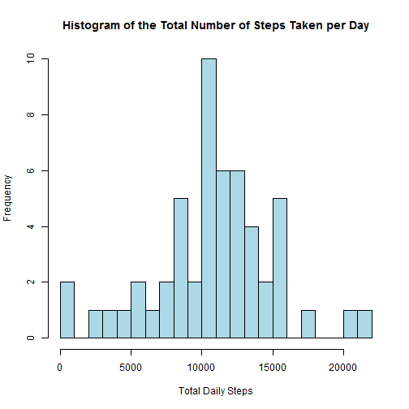
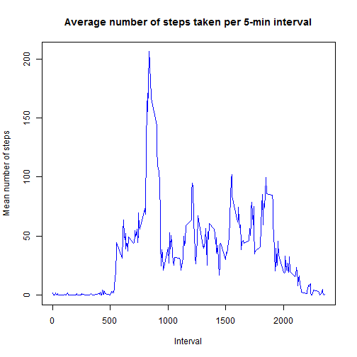
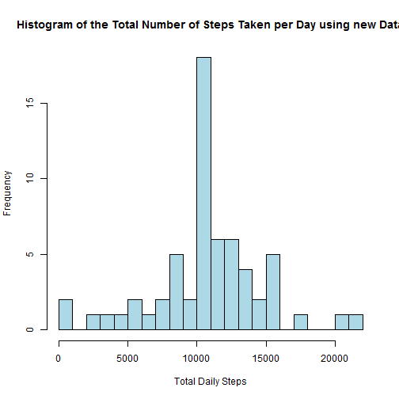

# Reproducible Research: Peer Assessment 1
Please note, before running the scripts given here, first download the activity data, and set the working directory to where the data is extracted. Also, install plyr and lattice packages.


```r
setwd("./RepData_PeerAssessment1")
install.packages("plyr")
library("plyr")
install.packages("lattice")
library("lattice")
```


## Loading and preprocessing the data
The following code reads the activity.csv file, and sets the class of the columns.


```r
Data <- read.csv("activity.csv", header = TRUE, sep = ",", stringsAsFactors = FALSE)
Data$steps <- as.numeric(Data$steps)
Data$date <- as.Date(Data$date)
Data$interval <- as.numeric(Data$interval)
```


## What is mean total number of steps taken per day?


```r
totalSteps <- aggregate(Data$steps, list(Date = Data$date), sum)
totalSteps <- totalSteps[complete.cases(totalSteps), ]
mean_tot <- mean(totalSteps[, c("x")], na.rm = TRUE)
median_tot <- median(totalSteps[, c("x")], na.rm = TRUE)
hist(totalSteps$x, col = "lightblue", xlab = "Total Daily Steps", ylab = "Frequency", 
    main = "Histogram of the Total Number of Steps Taken per Day", breaks = 20)
```

 

**Fig. 1: Histogram of the total number of steps taken each day.**

The mean and median of total number of steps taken per day are 1.0766 &times; 10<sup>4</sup> and 1.0765 &times; 10<sup>4</sup> respectively.

## What is the average daily activity pattern?


```r
averageSteps <- aggregate(Data$steps, list(Date = Data$date, Interval = Data$interval), mean)
averageSteps <- averageSteps[complete.cases(averageSteps), ]
average <- aggregate(averageSteps$x, list(Interval = averageSteps$Interval), mean)
interval <- average[which.max(average$x), ]
interval <- interval$Interval
plot(average$Interval, average$x, type = "l", col = "blue", xlab = "Interval", 
    ylab = "Mean number of steps", main = "Average number of steps taken per 5-min interval")
```

 

**Fig. 2: Time series plot of the average number of steps taken per 5-minute interval, averaged across all days.**

The five minute interval with the highest average number of steps taken is 835.

## Imputing missing values


```r
no_NAs <- nrow(Data[is.na(Data$steps), ])
```


The total number of missing values in the dataset (i.e. the total number of rows with NAs) is 2304.

I have decided to replace the missing no. of steps with the average no. of steps, per interval. For this, I created a blank dataframe, to which I bound each row of the original dataframe after replacing the steps which have value NA with the average steps value taken from the vector which was calculated in the previous stage.


```r
newData <- data.frame(steps = as.numeric(integer()), date = as.Date(character()), 
    interval = as.numeric(integer()), stringsAsFactors = FALSE)
for (i in 1:nrow(Data)) {
    tmp <- Data[i, c("steps", "date", "interval")]
    if (is.na(tmp$steps)) {
        step_value <- average[which(average$Interval == tmp$interval), ]
        step_value <- step_value$x
        tmp$steps <- step_value
    }
    newData <- rbind(newData, tmp)
}
result <- sum(is.na(newData))
```


As result is 0, we can say the new activity data created does not have any missing values. All missing values have been replaced by the mean value for that interval.


```r
new_totalSteps <- aggregate(newData$steps, list(Date = newData$date), sum)
new_totalSteps <- new_totalSteps[complete.cases(new_totalSteps), ]
new_mean_tot <- mean(new_totalSteps[, c("x")], na.rm = TRUE)
new_median_tot <- median(new_totalSteps[, c("x")], na.rm = TRUE)
hist(new_totalSteps$x, col = "lightblue", xlab = "Total Daily Steps", ylab = "Frequency", breaks = 20,
    main = "Histogram of the Total Number of Steps Taken per Day using new Data")
```

 

**Fig. 3: Histogram of the total number of steps taken each day using new activity data.**

The mean and median of total number of steps taken per day are 1.0766 &times; 10<sup>4</sup> and 1.0766 &times; 10<sup>4</sup> respectively using new activity data.
As we can see, while the mean remains unchanged, the median for the completed activity data is now exactly equal to the mean.
Overall, we can say that there is no drastic difference between the original, and new activity data.

## Are there differences in activity patterns between weekdays and weekends?


```r
day <- as.vector(character())
for (i in 1:nrow(newData)) {
    tmp <- newData[i, c("steps", "date", "interval")]
    day <- append(day, weekdays(tmp$date))
    if (identical(day[i], "Sunday")) {
        day[i] <- "Weekend"
    } else {
        if (identical(day[i], "Saturday")) {
            day[i] <- "Weekend"
        } else {
            day[i] <- "Weekday"
        }
    }
}
newData <- cbind(newData, day)
daySteps <- ddply(newData, c("interval", "day"), function(x) apply(x[1], 2, mean))
xyplot(daySteps$steps ~ daySteps$interval | daySteps$day, type = "l", ylab = "Number of Steps", 
    xlab = "Interval", layout = c(1, 2))
```

 

**Fig. 4: Average number of steps taken per 5 minute interval for weekdays and weekends.**
